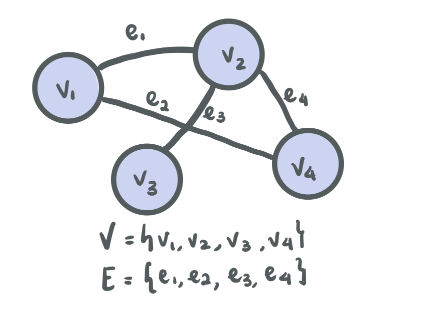
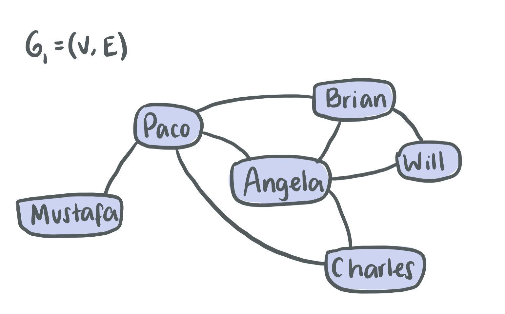
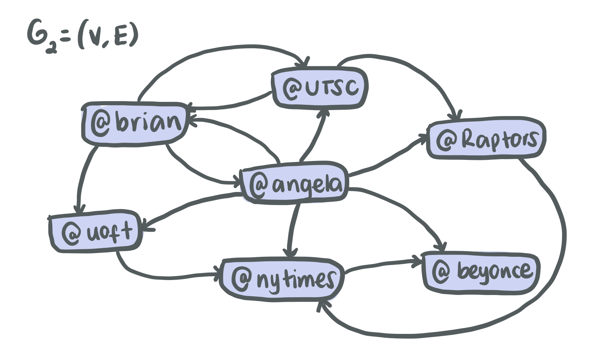

---


<p align="center"> <a href="https://youtu.be/isbd5BAG3_o"> Recorded videos (Thanks Willy!) </a> </p>

---

# Graphs

Graphs are used as a model to represent the relationship between the representation of items and problem we need to solve. We are trying to find a different way to represent a problem and use tools to solve it.

---

# Definition of a Graph

Each graph **G = (V,E)** consists of:

- A set of **nodes** that represent data items. We call that set **V**.
- A set of **edges** that represent the connections (relationship) between nodes. We call that set **E**.



---

# Types of Graphs

There are two general types of graphs, **undirected** and **directed**

## Undirected graphs

Graphs with edges that represent direction in both ways, in other words, there is a reciprocal relationship.

<span style="color:cornflowerblue">_Example:_</span> Facebook's friend network



## Directed graphs

Graphs with edges that represent one side direction, in other words, there is a one way relationship.

<span style="color:cornflowerblue">_Example:_</span> Twitter's followers network



---

# Terms to remember

## Neighbours

For an undirected graph, a node **v** is a **neighbour** of the node **u** if there exists an edge between those two nodes (that edge is represented by **{u,v}**). 

<span style="color:cornflowerblue">_Example:_</span> In **G<sub>1</sub>**, the neighbour of Mustafa is Paco.

For a directed graph, a node **v** is a **in-neighbour** of the node **u** if there exists an edge **{u,v}** from **u** to **v**. A node **v** is a **out-neighbour** of the node **u** if there exists an edge **{v,u}** from **v** to **u**. 

<span style="color:cornflowerblue">_Example:_</span> In **G<sub>2</sub>**, @Raptors is an in-neighbour of @UTSC, and @UTSC is an out-neightbour of @Raptors.

## Neighbourhood

For an undirected graph, the **neighbourhood** of a node **v** is the set of all nodes that are neighbours of **v**.

<span style="color:cornflowerblue">_Example:_</span> In **G<sub>1</sub>**, the neighbourhood of Charles is the set of nodes {Paco, Angela}.

For a directed graph, there exists an **out-neighbourhood** and an **in-neighbourhood**.

<span style="color:cornflowerblue">_Example:_</span> In **G<sub>2</sub>**, the out-neighbourhood of @Brian is the set of the nodes {@UTSC, @Uoft, @Angela} and the in-neighbourhood of @Brian is the set of the nodes {@UTSC, @Angela}

## Degree

For an undirected graph, the **degree** of a node **v** is the size (number of nodes) in the neighbourhood of **v**.

<span style="color:cornflowerblue">_Example:_</span> In **G<sub>1</sub>**, the degree of Will is 2.

For a directed graph, the node **v** has an **in-degree** and an **out-degree**.

<span style="color:cornflowerblue">_Example:_</span> In **G<sub>2</sub>**, the out-degree of @nytimes is 1 and the in-degree is 3.

## Path

A **path** is a sequence of consecutive nodes that can be visited by following exisiting edges between each pair of consevutive nodes.

## Cycle

For undirected graphs, a **cycle** is a path with at least three nodes that starts and ends at the same node.

<span style="color:cornflowerblue">_Example:_</span> In **G<sub>1</sub>**, there is a cycle between the nodes Brian, Will and Angela.

For directed graphs, a **cycle** is a path that begins and ends at the same node, but in this case the path can have any number of nodes.

<span style="color:cornflowerblue">_Example:_</span> In **G<sub>2</sub>**, there is a cycle between the nodes @Brian, @UTSC and @Angela.

### Practice Exercises

Find the neighbourhood and degree of each node in **G<sub>1</sub>** and **G<sub>2</sub>**. Find all cycles in **G<sub>1</sub>** and **G<sub>2</sub>**.

---

# Representing Graphs

## Adjacency list

The **adjacency list** is an array of size _N_ with one entry per node, where _N_ is the number of nodes in the grpah. The _i<sup>th</sup>_ entry of the array contains a pointer to a linked list that stores the indexes of the nodes that _i_ is connected to (the neighbours of _i_).

## Adjacency matrix

The **adjacency matrix** is a 2D array of size _N_ x _N_, where _N_ is the number of nodes in the graph. For an undirected graph, the entry **A[i][j]** is 1 if nodes **i** and **j** are connected, and zero otherwise. For a directed graph, the entry **A[i][j]** is 1 if there is an edge from **i** to **j**, and zero otherwise.

### Practice Exercises

Represent **G<sub>1</sub>** and **G<sub>2</sub>** using Adjacency lists and matrices.

# Followers distance

Read the code below and complete the two empty functions to add into the following list and to find the minimum distance (i.e. number of edges) between two twitter users.

```c
#include <string.h>
#include <stdio.h>
#include <stdbool.h>
#include <stdlib.h>

#define MAX_STR_LEN 1024

// User struct
typedef struct user_struct {
    // Twitter Handle
    char twitter_handle[MAX_STR_LEN];
    // List of accounts following
    struct following_node_struct* following;
    // Marker to know if we have visited the node
    // It will come handy
    bool visited;
} User;

// LL for list of accounts following
typedef struct following_node_struct {
    // User following
    User* user;
    struct following_node_struct* next;
} FollowingNode;

// Function to create a user and initialize
// the following list
User* create_user(char* handle){
    // Initialize user
    User *new_user = NULL;
    new_user = (User*)calloc(1, sizeof(User));
    if(new_user == NULL) return NULL;
    new_user->following = NULL;
    strcpy(new_user->twitter_handle, handle);
    new_user->visited = false;

    return new_user;
}

// User following
void follow_user(User* user, User* new_follower) {
    // TODO
}

// Minimum following distance
int get_distance(User* a, User* b){
    // TODO
    // You can even use helper functions!
}

int main(){
    // Let's create a couple of users
    User* angela = create_user("_angelazb");
    User* brian = create_user("brianUTSC");
    User* will = create_user("willysong");
    // Angela will follow Brian on twitter
    follow_user(angela, brian);
    // Brian will follow Willy
    follow_user(brian,will);
    int angela_and_brian = get_distance(angela, brian);
    // Should return 1
    printf("Connections between Angela and Brian: %d\n", angela_and_brian);
    // Should return 2
    int angela_and_will = get_distance(angela, will);
    printf("Connections between Angela and Will: %d\n", angela_and_will);
}

```
---
