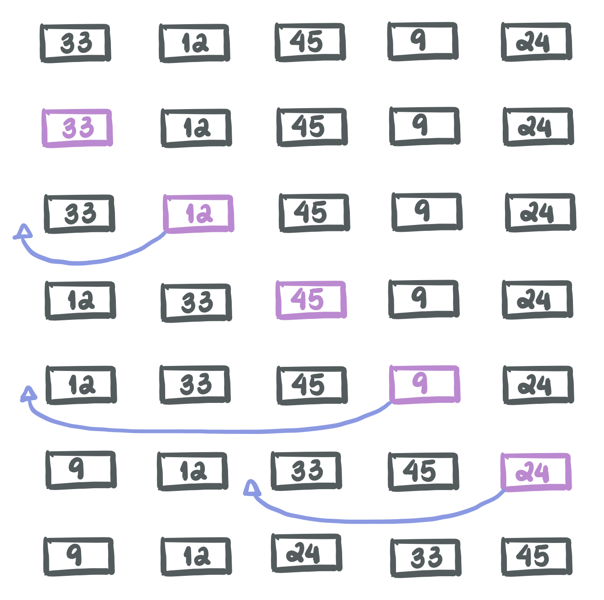
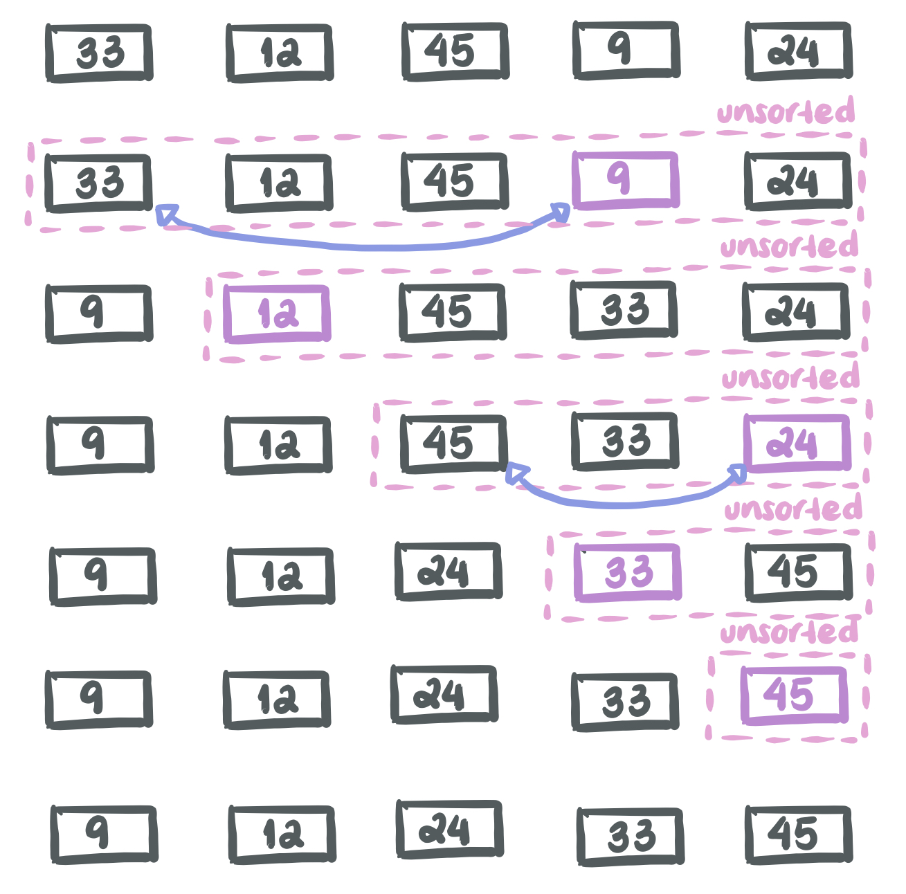

---


<p align="center"> <a href="https://youtu.be/e3-GDIa1h5k"> Recorded videos (Thanks Will!) </a> </p>

---

# Insertion Sort


Insertion Sort is a sorting algorithm that takes one element at a time and compares it with the elements prior to it.

### Example:

Let's consider the array ```[33, 12, 45, 9, 24]```



---

## How can we implement it?

---

Our goal is to sort an array of n elements: [a<sub>0</sub>, a<sub>1</sub>, a<sub>2</sub>, ..., a<sub>n-1</sub>]

We are going to grab each element one by one, in order, and compare it with all the previous elements, which will be already sorted.

### Pseudocode

1. Loop through the n elements of the array
2. Get the ith element
3. Move the the elements of the subarray [a<sub>0</sub>, a<sub>1</sub>, ..., a<sub>i-1</sub>] that are greater than the ith element.

### Starter Code

```c
# include <math.h>
# include <stdio.h>

void insertionSort(int arr[], int n) {
  // Use the pseudocode to complete this part
}

int main(){
  int array[] = {33, 12, 45, 9, 24};
  int n = 5;
  insertionSort(array, n);

  // Print to double check
  for (int i = 0; i < n; i++){
    printf("%d ", array[i])
  }
}
```
---

## Discussion

---

Sort the following arrays by traversing through your code. How many steps does it take to complete the sort?

1. ```[33, 12, 45, 9, 24]```
2. ```[1, 2, 3, 4, 5, 6]```
3. ```[2, 3, 4, 5, 6, 1]```
4. ```[6, 5, 4, 3, 2, 1]```

Which one took longer? 

---

# Selection Sort

Selection Sort is a sorting algorithm that in every iteration, finds the minimum element that has not being sorted and moves it at the beginning of the array.

### Example:

Let's consider, again, the array ```[33, 12, 45, 9, 24]```



---

## How can we implement it?

---

Our goal is to sort an array of n elements: [a<sub>0</sub>, a<sub>1</sub>, a<sub>2</sub>, ..., a<sub>n-1</sub>]

We are going to find the smallest element of the array and move it at the front to create a sorted array. We will pretty much divide the array into a sorted subarray (the beginning) and the unsorted array (the reminder - elements that haven't been sorted yet). We will swap the found minimum element with the first element of the unsorted portion of the array.

### Pseudocode

1. Loop through the n elements of the array
2. Find the minimum element in the unsorted portion of the array
3. Swap the found minimum element with the first element of the unsorted portion.

### Starter Code

```c
# include <stdio.h>

void selectionSort(int arr[], int n) {
  // Use the pseudocode to complete this part
}

int main(){
  int array[] = {33, 12, 45, 9, 24};

  selectionSort(array, 5);

  // Print to double check
  for (int i = 0; i < n; i++){
    printf("%d ", array[i])
  }
}
```
---

## Discussion

---

Sort the following arrays by traversing through your code. How many steps does it take to complete the sort?

1. ```[33, 12, 45, 9, 24]```
2. ```[1, 2, 3, 4, 5, 6]```
3. ```[2, 3, 4, 5, 6, 1]```
4. ```[6, 5, 4, 3, 2, 1]```

Which one took longer? Are the results similar to the Insertion Sort?

---
